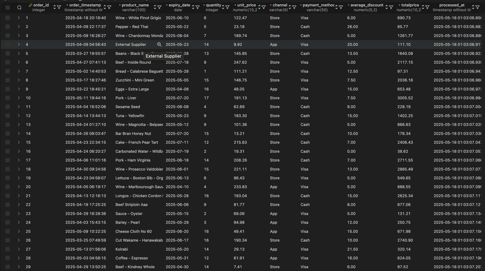
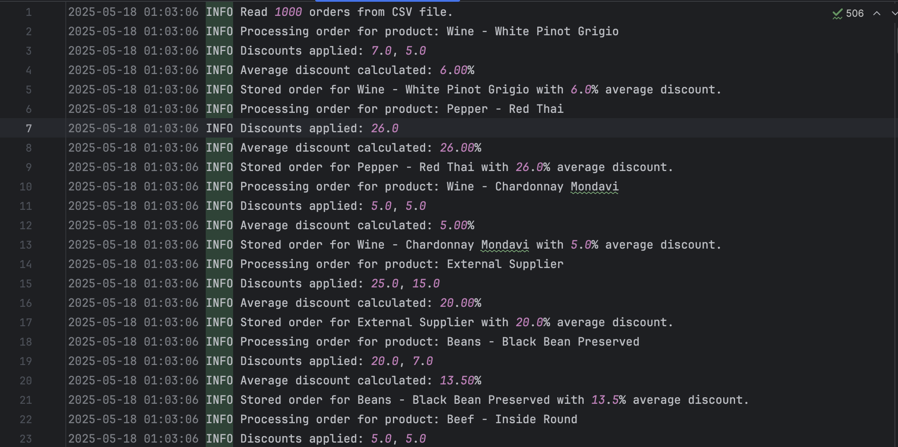

# Rule-Based Discount Engine

## Overview

This project implements a **Rule-Based Discount Engine** for a large retail store using **Scala** with a functional programming approach.  
It evaluates sales transactions against multiple discount qualifying rules and calculates appropriate discounts automatically.

The system supports combining multiple applicable discounts by averaging the top two qualifying discounts and produces the final discounted price per transaction.

## Features
- Pure functional programming principles:  
  - Immutable data (no vars, only vals)  
  - No side effects in core logic  
  - No loops; use recursion or functional combinators  
- Multiple qualifying discount rules support  
- Calculated discount is the average of the top two discounts if more than one applies  
- Logging engine events with timestamps and log levels to `rules_engine.log`  
- Load results (including final price) into a database (Postgres) (configurable) 

---

## Qualifying Rules and Discount Calculations

The engine applies several discount rules based on order details and transaction context. Below are the detailed qualifying rules with their respective calculation rules.

### 1. Product Expiry Discount

- Applies if the product expires within 30 days from the transaction date.
- Discount increases as expiry approaches:
  - 29 days remaining → 1% discount  
  - 28 days remaining → 2% discount  
  - 27 days remaining → 3% discount  
  - … continuing linearly  
  - 1 day remaining → 29% discount  

*Example:* If a product expires in 10 days from transaction, discount = 20%.

---

### 2. Product Category Discount (Cheese and Wine)

- Specific discount for cheese and wine products:
  - Cheese → 10% discount  
  - Wine → 5% discount  

---

### 3. Special Date Discount

- Transactions made on **March 23rd** qualify for a **50% discount**.

---

### 4. Quantity-Based Discount

- If more than 5 units of the same product are purchased:
  - 6 to 9 units → 5% discount  
  - 10 to 14 units → 7% discount  
  - 15 or more units → 10% discount  

---

### 5. App Usage Discount (New Requirement)

- Sales made through the **App** qualify for a special discount calculated by quantity rounded up to nearest multiple of 5:  
  - Quantity 1-5 → 5% discount  
  - Quantity 6-10 → 10% discount  
  - Quantity 11-15 → 15% discount  
  - … and so forth, increasing by 5% per each 5 units.

---

### 6. Visa Card Payment Discount (New Requirement)

- Sales paid using **Visa cards** qualify for a flat **5% discount**.

---

## Combining Discounts

- If multiple discount rules apply, the engine picks the **top two highest discount percentages** and calculates the **average** of these two to determine the final discount percentage.

- If no rules apply, the discount is **0%**.

---

## Discount Calculation Example

Assume a transaction with the following details:  
- Product expires in 5 days → 25% discount  
- Product is cheese → 10% discount  
- Quantity purchased: 12 units → 7% discount  
- Paid via Visa → 5% discount  
- Sale through App with quantity 12 → 15% discount  
- Transaction date is not March 23

Applicable discounts: 25%, 15%, 10%, 7%, 5%  
Top two: 25% and 15%  
Final discount = (25% + 15%) / 2 = 20%

---

## Project Structure

```
src/
├── Get_order_discount.scala     # Main entry point, orchestrates data reading and discount calculation
├── LoggerFactory.scala/         # logger class
├── rules_engine.log             # log file output
├── table.sql                    # DDl for table that store the data in postgrs
├── TRX1000.csv                  # order Data
├── README.md                    # document all project steps


```

---

## How It Works

1. **Input:** The engine reads raw order transaction data including product info, quantity, transaction timestamp, payment method, and channel.

2. **Rule Evaluation:** Each rule module evaluates if the transaction qualifies for a discount and returns the calculated discount percentage.

3. **Discount Aggregation:**  
   - Gather all qualifying discount percentages.  
   - Sort and select the top two.  
   - Compute their average as the final discount percentage.

4. **Final Price:** Calculate the discounted price by applying the final discount to the original transaction price.

5. **Output:**  
   - Log discount calculation events with timestamps and log levels.  
   - Load the enriched transaction data including final price into a target database table.
   

---

## Logging

- All events in the engine lifecycle are logged in `rules_engine.log` using the format:  
  ```
  TIMESTAMP     LOGLEVEL      MESSAGE
  ```
  

---

## Technical Highlights

- **Pure functional approach:** No mutable state, side-effects isolated to input/output boundaries.
- **Scala features:** Uses pattern matching, higher-order functions, and immutability.
- **Extensibility:** Adding new discount rules involves creating new qualifying and calculation functions following existing conventions.
- **Testing:** Core logic is testable via pure functions with predictable input-output.

---

## How to Run

1. Clone the repo:

   ```bash
   git clone https://github.com/MuhamedHekal/Rule-Based-Discount-Engine.git
   cd Rule-Based-Discount-Engine
   ```

2. Build and run the Scala project using sbt or your preferred Scala build tool.

3. Provide raw transaction data as input.

4. Review `rules_engine.log` for processing logs.

5. Check output database table for final discounted transactions.

---
